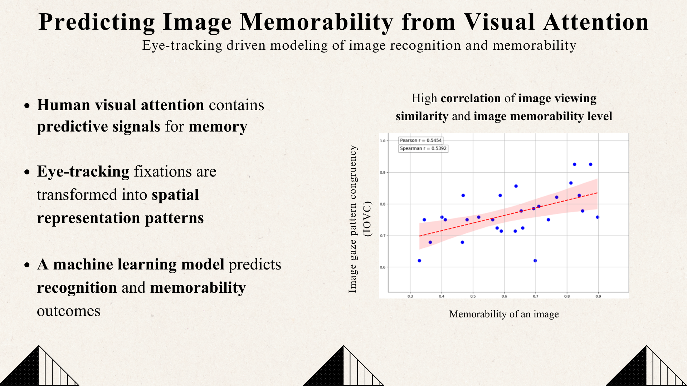

# Image Memorability Prediction from Eye-Tracking

Predicting image memorability / recognition outcomes using eye-tracking fixation data.

##  What this repo contains:
- Trained model for memorability prediction on static images
- Model' Input: fixation maps
- Model's Output: (1) image class among N images, (2) image remembered vs not-remembered confidence score

### Demo

## Data used:
FIGRIM (Bylinskii et al., MIT, 2015): ([link] (http://dx.doi.org/10.1016/j.visres.2015.03.005))

## My collected dataset: not included (privacy);

## Results (summary)
- Trained model with image classification accuracy (30 classes) of 92.35% (not publicly available)
- Memorability prediction evaluated via IOVC-based metrics
- Additional inference-thresholding stage used to separate successful vs unsuccessful viewings [Inteference_Thresholding](inference_tresholding.png)

## Reproducibility
- Python: 3.9
- Libraries: PyTorch, TensorFlow, NumPy, scikit-learn
