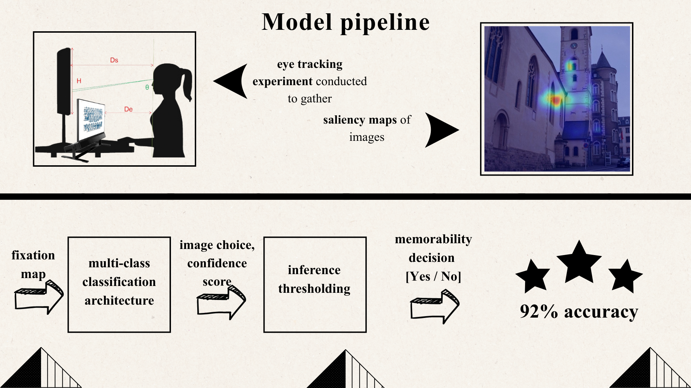

# Image Memorability Prediction from Eye-Tracking

Predicting image recognition and memorability outcomes using eye-tracking fixation data (fixation maps).

## Overview
This repository is a **research demonstration** of how visual attention patterns (eye fixations) can be transformed into spatial representations and used to predict:
1) **which image was viewed** (multi-class classification over *N* target images), and  
2) **whether it will be remembered** (memorability / recognition outcome).

The data for this research was gathered through a **real-world scientific experiment** inside the **Innovation Center of the School of Electrical Engineering**, Belgrade.
More than **850 participant eye-tracking data** was gathered.

Parts of this work were published in an international conference and a national conference.¹

## Demo (pipeline)

## Data
- **Public dataset:** FIGRIM (Bylinskii et al., 2015). DOI link: http://dx.doi.org/10.1016/j.visres.2015.03.005  
- **My collected dataset:** not included (privacy / consent).

## Results (high-level)
- Multi-class classification over **30 target images** using fixation-map inputs  
- Memorability / recognition analysis evaluated with **IOVC-based metrics**
- An additional **inference thresholding** stage was used to separate successful vs. unsuccessful viewings:  

> Note: This repo focuses on communicating the methodology and analysis workflow.  
> Trained checkpoints and private raw logs are not included.

## Repository structure
- `src/main/` – main training notebook (architectures tried / comparisons)  
- `src/data_analysis/` – analysis modules (IOVC, correlations, saliency maps, rankings, etc.)  
- `assets/` – figures used in the README / poster-style summary  
- `target_images/` – the 30 target images used in the experiments (if publicly shareable)

## References
1. V. Matvejev, D. Drašković,  
   *Predviđanje uspešnosti memorizacije slike pomoću modela mašinskog učenja*,  
   Proceedings of the **31st National ICT Conference YU INFO 2025**,  
   Kopaonik, Serbia, 2025, pp. 1–6.  
   ISBN: 978-86-85525-33-9

## Reproducibility (best effort)
- Python: 3.9  
- Key libraries: PyTorch, TensorFlow, NumPy, scikit-learn  

If you are interested in replicating the full pipeline, feel free to reach out.
